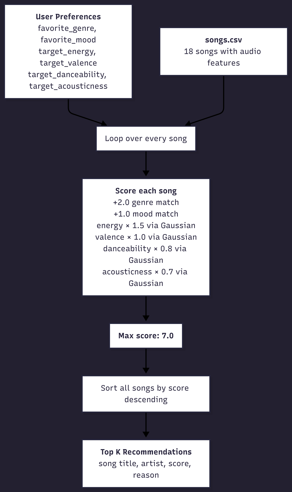
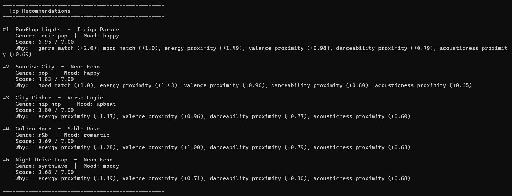

# 🎵 Music Recommender Simulation

## Project Summary

In this project you will build and explain a small music recommender system.

Your goal is to:

- Represent songs and a user "taste profile" as data
- Design a scoring rule that turns that data into recommendations
- Evaluate what your system gets right and wrong
- Reflect on how this mirrors real world AI recommenders

In this project, we build a **content-based music recommender** that matches songs to a user taste profile using audio features. Given a catalog of 18 songs across genres like indie pop, metal, blues, and classical, the system scores each song against a user's preferences — `favorite_genre`, `favorite_mood`, `target_energy`, `target_valence`, `target_danceability`, and `target_acousticness` — and returns the top `k` matches. Numerical features are scored using a **Gaussian proximity formula** that rewards closeness to the user's target values, while genre and mood matches add a categorical bonus. The result is a ranked list of recommendations that reflects *how a song feels* relative to the user's taste, not just whether it fits a single category.

---

## How The System Works
Real-world recommendation systems like Spotify and YouTube use a combination of **collaborative filtering** (mapping users to each other based on listening behavior, then borrowing recommendations from similar users) and **content-based filtering** (analyzing the song itself — features like tempo, valence, acousticness, and danceability — to find tracks that *sound* like what you already like). Our system focuses on the content-based side, using those same audio features from `data/songs.csv`.

Each `Song` stores 5 numerical taste signals — `energy`, `valence`, `danceability`, `acousticness`, and `tempo_bpm` — plus categorical tags for `genre` and `mood`. A `UserProfile` stores a user's preferred genre, preferred mood, target energy level, and whether they lean acoustic. The `Recommender` scores each song by measuring how close it is to those preferences — categorical matches (genre, mood) add a bonus, and numerical features like energy use a **Gaussian proximity formula** that rewards closeness to the user's target rather than just high or low values. All songs are scored and sorted, and the top `k` results are returned as recommendations.



### Algorithm Recipe

Each song is scored against the user profile using the following rules:

| Signal | Type | Points |
|---|---|---|
| Genre match | Categorical (`==`) | +2.0 |
| Mood match | Categorical (`==`) | +1.0 |
| Energy proximity | Gaussian × 1.5 | 0.0 – 1.5 |
| Valence proximity | Gaussian × 1.0 | 0.0 – 1.0 |
| Danceability proximity | Gaussian × 0.8 | 0.0 – 0.8 |
| Acousticness proximity | Gaussian × 0.7 | 0.0 – 0.7 |

**Max possible score: 7.0.** Gaussian proximity is calculated as `exp(-5 × (song_value − target)²)`, which returns 1.0 for a perfect match and decays toward 0 as the song moves further from the user's target.

The final ranking sorts all 18 songs by total score descending and returns the top `k` (default: 5).

### Potential Biases

- **Genre over-prioritization:** A +2.0 genre bonus can push a mediocre genre match above a near-perfect audio match from a different genre — a great metal song might never surface for an indie pop listener even if the energy and mood align closely.
- **Mood is an exact match:** `"happy"` and `"upbeat"` are treated as completely different, even though they're emotionally similar — the system has no concept of mood proximity.
- **Small catalog amplifies bias:** With only 18 songs, a single genre can dominate the top-5 if several songs share the user's favorite genre, reducing diversity in results.

### User Profiles

#### Main User Profile

The system scores every song against a single user profile — a dictionary of target values that represents what the user likes. Categorical fields (`favorite_genre`, `favorite_mood`) are compared with an exact match, while numerical fields (`target_energy`, `target_valence`, `target_danceability`, `target_acousticness`) feed into the Gaussian proximity formula. The `likes_acoustic` flag is a convenience boolean that mirrors `target_acousticness` for cases where a simple yes/no is enough.

The profile below is the one used in this simulation — it represents a listener who gravitates toward upbeat, moderately high-energy indie pop, leans produced over acoustic, and values positive-sounding songs:

```python
user_prefs = {
    "favorite_genre": "indie pop",
    "favorite_mood": "happy",
    "target_energy": 0.72,
    "target_valence": 0.75,
    "target_danceability": 0.76,
    "target_acousticness": 0.30,
    "likes_acoustic": False
}
```

This profile was designed to sit clearly between extremes — high enough energy to distinguish it from chill lo-fi (~0.35–0.42) but not so extreme that it collapses into metal or rock territory (~0.91–0.97). 

The songs that the recommender suggested for our user profile are below (terminal output of running application):



#### Additional User Profiles
Profile 1: High-Energy Pop 


Profile 2: Chill Lofi 


Profile 3: Deep Intense Rock 


---

## Getting Started

### Setup

1. Create a virtual environment (optional but recommended):

   ```bash
   python -m venv .venv
   source .venv/bin/activate      # Mac or Linux
   .venv\Scripts\activate         # Windows

2. Install dependencies

```bash
pip install -r requirements.txt
```

3. Run the app:

```bash
python -m src.main
```

### Running Tests

Run the starter tests with:

```bash
pytest
```

You can add more tests in `tests/test_recommender.py`.

---

## Experiments You Tried

### Baseline Output (Final Weights)

Run with 6 profiles — 3 standard, 3 adversarial — using final weights: genre +1.5, mood +0.75, energy ×2.0, valence ×1.0, danceability ×0.9, acousticness ×0.85 (max score 7.0).

```
Profile: High-Energy Pop      → #1 Gym Hero (7.00)
Profile: Chill Lofi           → #1 Library Rain (6.97)
Profile: Deep Intense Rock    → #1 Storm Runner (7.00)
Profile: Conflicting          → #1 Three AM Blues (4.88)  ← genre+mood bonus overpowers low energy
Profile: The Neutralist       → #1 Midnight Coding (4.44) ← lofi wins by numerical proximity alone
Profile: Acoustic but Intense → #1 Iron Cathedral (4.64)  ← energy beats genre in contradiction
```

---

### Experiment 1 — Weight Shift: Energy ×2 (2.0 → 4.0), Genre Halved (1.5 → 0.75)

**What changed:** Doubled the energy weight and halved the genre weight to test whether audio feel could dominate over categorical labels.

**Result:** Rankings stayed mostly the same for standard profiles — the correct songs still ranked #1. The biggest visible change was in the **Conflicting** profile: Three AM Blues dropped out of #1 entirely, replaced by Iron Cathedral (`6.09`) and Storm Runner (`5.90`), which actually matched the `target_energy: 0.90`. The system became more "honest" about the conflict. However, scores exceeded 7.00 (e.g. Gym Hero at `8.25`), breaking the max score assumption — a math side effect of doubling one weight without adjusting others.

**Conclusion:** More accurate for adversarial cases, but the uncapped scores make results harder to interpret. Not worth keeping.

---

### Experiment 2 — Feature Removal: Mood Check Removed

**What changed:** Removed the `+0.75` mood match bonus entirely, keeping all numerical weights at final values.

**Result:** The **Chill Lofi** profile showed the most interesting shift — Focus Flow (`focused` mood) jumped to #1, displacing Library Rain and Midnight Coding (both `chill`). Without mood as a tiebreaker, all three lofi songs became nearly equal by audio features alone, and Focus Flow edged out by pure numerical closeness. The **Conflicting** profile also shifted: Three AM Blues dropped to #2 (`4.13`) and Iron Cathedral took #1 (`4.14`) — the genre bonus alone couldn't carry Three AM Blues anymore.

**Conclusion:** Removing mood made rankings more "feel-based" and less label-dependent. Interesting, but mood adds real signal for distinguishing songs within the same genre — keeping it in at a modest weight (`+0.75`) is the right call.

---

## Limitations and Risks

- **Catalog density bias:** 3 of 18 songs are lo-fi, making lo-fi disproportionately likely to surface for neutral or mid-energy users — not because it's the best match, but because the catalog has more of it near the numerical middle.
- **Exact-match mood creates false cliffs:** `"happy"` and `"upbeat"` score identically to `"happy"` vs `"metal"` — the system has no concept of mood similarity, only equality.
- **Genre labels are not hierarchical:** `"indie pop"` and `"pop"` are treated as completely unrelated. A user who likes indie pop gets zero genre credit for pop songs, even though the genres are closely related.
- **No cross-feature awareness:** Energy and acousticness are scored independently. The system can't recognize that high-energy + high-acousticness is a near-impossible combination in real music, so contradictory profiles produce nonsensical results without any warning.
- **Static profile:** The user profile never updates. There is no concept of a skip, a replay, or a session — the same 5 songs are recommended every time regardless of feedback.

---

## Reflection

Read and complete `model_card.md`:

[**Model Card**](model_card.md)

Write 1 to 2 paragraphs here about what you learned:

- about how recommenders turn data into predictions
- about where bias or unfairness could show up in systems like this


---

## 7. `model_card_template.md`

Combines reflection and model card framing from the Module 3 guidance. :contentReference[oaicite:2]{index=2}  

```markdown
# 🎧 Model Card - Music Recommender Simulation

## 1. Model Name

Give your recommender a name, for example:

> VibeFinder 1.0

---

## 2. Intended Use

- What is this system trying to do
- Who is it for

Example:

> This model suggests 3 to 5 songs from a small catalog based on a user's preferred genre, mood, and energy level. It is for classroom exploration only, not for real users.

---

## 3. How It Works (Short Explanation)

Describe your scoring logic in plain language.

- What features of each song does it consider
- What information about the user does it use
- How does it turn those into a number

Try to avoid code in this section, treat it like an explanation to a non programmer.

---

## 4. Data

Describe your dataset.

- How many songs are in `data/songs.csv`
- Did you add or remove any songs
- What kinds of genres or moods are represented
- Whose taste does this data mostly reflect

---

## 5. Strengths

Where does your recommender work well

You can think about:
- Situations where the top results "felt right"
- Particular user profiles it served well
- Simplicity or transparency benefits

---

## 6. Limitations and Bias

Where does your recommender struggle

Some prompts:
- Does it ignore some genres or moods
- Does it treat all users as if they have the same taste shape
- Is it biased toward high energy or one genre by default
- How could this be unfair if used in a real product

---

## 7. Evaluation

How did you check your system

Examples:
- You tried multiple user profiles and wrote down whether the results matched your expectations
- You compared your simulation to what a real app like Spotify or YouTube tends to recommend
- You wrote tests for your scoring logic

You do not need a numeric metric, but if you used one, explain what it measures.

---

## 8. Future Work

If you had more time, how would you improve this recommender

Examples:

- Add support for multiple users and "group vibe" recommendations
- Balance diversity of songs instead of always picking the closest match
- Use more features, like tempo ranges or lyric themes

---

## 9. Personal Reflection

A few sentences about what you learned:

- What surprised you about how your system behaved
- How did building this change how you think about real music recommenders
- Where do you think human judgment still matters, even if the model seems "smart"

